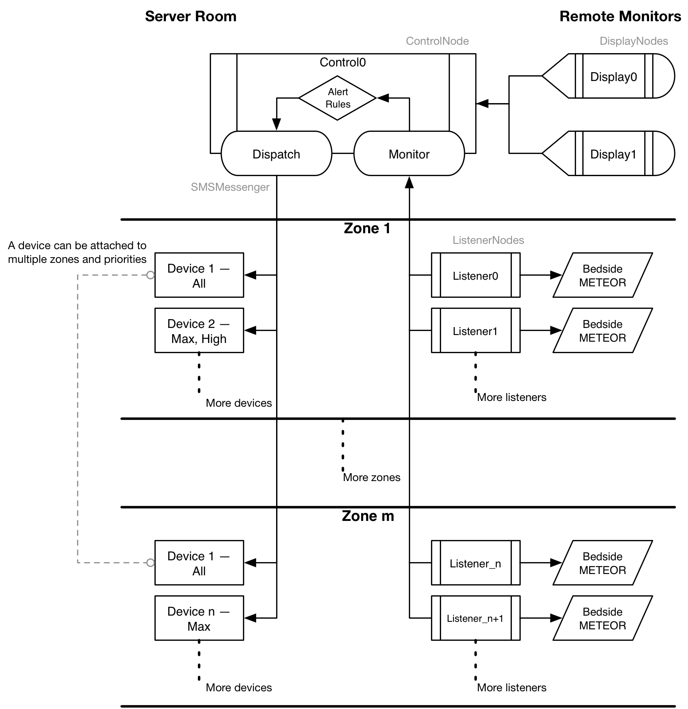

# PERSEUS
Push Electronic Relay for Smart Alarms for End User Situational Awareness

[Derek Merck](email:derek_merck@brown.edu)  
[Leo Kobayashi](email:lkobayashi@lifespan.org)  

<https://github.com/derekmerck/PERSEUS>


## Overview

_To be discussed by Leo._

Original test site is at [Rhode Island Hospital](http://www.rhodeislandhospital.org) Emergency Department.


## Installation

`$ pip install git+https://github.com/derekmerck/PERSEUS`


### Dependencies

- Python 2.7
- [numpy](http://www.numpy.org) for calculations
- [matplotlib](http://matplotlib.org) for simple plotting
- [PyYAML](http://pyyaml.org) for configuration info
- [Pyro4](https://pythonhosted.org/Pyro4/) for python-to-python communication
- [duppy](https://github.com/derekmerck/duppy) for set logic and wrapper utilities
- [Fabric](http://www.fabfile.org) for remote network administration

The [Anaconda](http://continuum.io/downloads) scientific python distribution includes numpy, matplotlib and pyyaml, and it works well for PERSEUS (the reference fab file uses it as a base distribution).  Pyro4 and duppy can be installed onto anaconda with `pip`.

`$ pip install Pyro4 git+https://github.com/derekmerck/duppy`


## Usage

PERSEUS is run as a number of semi-independent instances that form a hub topology about a control server.  

````bash
usage: PERSEUS.py [-h] [--config CONFIG] [-V] node_id [node_id ...]

PERSEUS Core

positional arguments:
  node_id          List of nodes in the topology to run on this instance

optional arguments:
  -h, --help       show this help message and exit
  --config CONFIG  YAML description of the topology and alert rules
  -V, --version    show program's version number and exit
````

A shared `config.yaml` file is used to describe the topology and provide other network settings.  The
following would invoke a three node network.

```bash
server$ python -m Pyro4.naming -n server
server$ python -m PERSEUS control0
remote$ python -m PERSEUS listener0
local$ python -m PERSEUS display0
```

In this case, the main station is running the nameserver and the controller.  `control0` acts as a central dispatch server, that accepts data streams, passes alerts to the SMS system, and pushes data streams out to graphical displays.  The remote station, `listener0` is running a listener that will forward information from bedside telemetry (a "METEOR" system) to the controller.  The local system is being used to monitor `listener0` via `control0` using a graphical display, `display0`.

The same 3-node configuration could be run entirely on a single host (or any combination).

```bash
local$ python -m Pyro4.naming -n local
local$ python -m PERSEUS control0 listener0 display0
```

However, because of Python's global interpreter lock (the "[GIL](https://wiki.python.org/moin/GlobalInterpreterLock)"), running all 3 nodes in a single thread is much less efficient than running each (or at least the display) in its own process.

Future plans include using [fabric](http://www.fabfile.org) or Docker to configure the entire network remotely.


## Configuration

`config.yaml` includes three document sections:  _topology_, _rules_, and _alert zones_.  See the example.

Also note that any confidential information (SMS credentials, phone numbers) can be referenced with a value "shadow" and included in a corresponding `shadow.yaml` file that follows the same format.  `shadow.yaml` is `.gitignored` by default.

### Troubleshooting Connection Problems

Pyro4 is somewhat picky about working outside of `localhost`.  See Pyro4's [tips-and-tricks](https://pythonhosted.org/Pyro4/tipstricks.html#failed-to-locate-the-nameserver-connection-refused-what-now) for more details.

1. Boot the nameserver and other daemons with a hostname that resolves to the IP address that the other nodes will use (_not_ `localhost`)
2. Make sure that you have the same version of Pyro4 on all machines, and that Python is allowed through any firewalls<sup id="a1">[1](#f1)</sup>


## Security

### Network Security

PERSEUS is promiscuous in transmitting data input or display requests.  Access can be controlled at the network level by using a VPN or private network, or by using Pyro4's HMAC authentication and a required shared key.  However, this is not particularly secure as anyone with access to your `shadow.yaml` file or code will be able to extract the key in plain.  

### SMS Alerts

Using gmail as the SMS relay requires either turning off app security in gmail, or assigning a unique relay password in the context of 2-step auth.


## Code Organization Overview




## Acknowledgements

- Initial development funded through a healthcare quality improvement award from the AHRQ
- SMS Messenger class cribbed in part from <https://github.com/CrakeNotSnowman/Python_Message>
- Indebted to discussion of pip at <https://hynek.me/articles/sharing-your-labor-of-love-pypi-quick-and-dirty/>
- SimpleDisplay based on matplotlib's [strip_chart example](http://matplotlib.org/1.4.0/examples/animation/strip_chart_demo.html)


## License

[MIT](http://opensource.org/licenses/mit-license.html)

---

<b id="f1">1</b>:  It appears that just allowing 9090 through (the default Pyro4 nameserver) is not enough.  The Pyro4 objects each use a different port number in the \>50k range.  This makes it problematic to use it inside Docker with only a few statically assigned ports exposed.[↩](#a1)