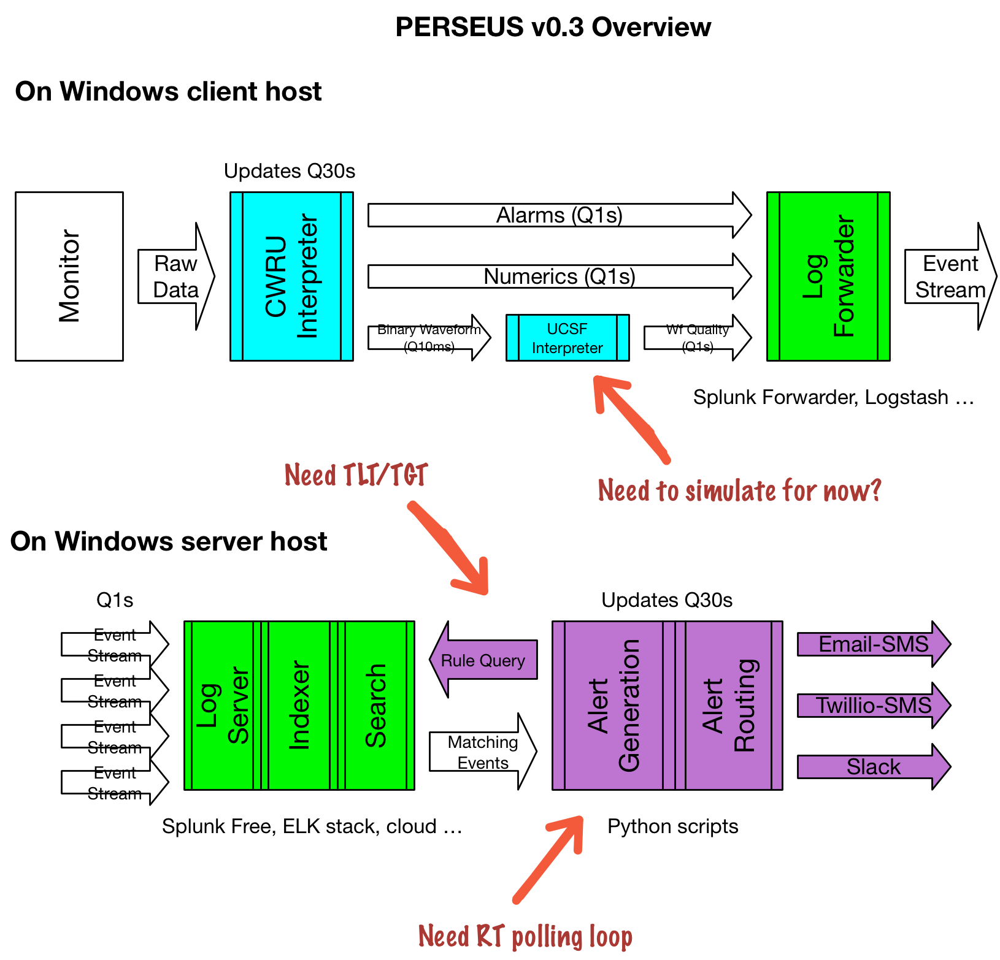

#  PERSEUS
Push Electronic Relay for Smart Alarms for End User Situational Awareness

[Derek Merck](email:derek_merck@brown.edu)  
[Leo Kobayashi](email:lkobayashi@lifespan.org)  

<https://github.com/derekmerck/PERSEUS>


## Overview

_To be discussed by Leo._

Original test site is at [Rhode Island Hospital](http://www.rhodeislandhospital.org) Emergency Department.


## Installation

`$ pip install git+https://github.com/derekmerck/PERSEUS`


### Dependencies

- Python 2.7
- [PyYAML](http://pyyaml.org) for configuration info
- Splunk API (for Splunk event storage)
- Twilio API (for Twilio alert routing)


## Usage

1. Install and configure a log server, such as Splunk (configuration directions below).
2. Install the monitor parser and waveform analyzer on each client machine
3. Install an appropriate log forwarder on each client machine.  Setup each client with a separate host name that will be used in the zone descriptions.  The log forwarder should ship alarms, numerics, and waveform quality logs to the log server.
4. Install PERSEUS Dispatch and dependencies on a central server
5. Modify the config.yaml file to represent the local rules, zone topology, and alert roles
6. Set your log server and messenger relay credentials (i.e., a gmail account, twilio auth, or slack url) as environment variables or using a `shadow.yaml` file
7. Run PERSEUS Dispatch

```bash
$ python -m PERSEUS
```

## Configuration

`config.yaml` includes three required keys:  _rules_, _zones_, and _roles_.  See the example provided.


## Security

### Email-SMS Alerts

Using gmail as an SMS relay requires either turning off app security in gmail, or assigning a unique relay password in the context of 2-step auth.


## Code Organization Overview




## Acknowledgements

- Initial development funded through a healthcare quality improvement award from the AHRQ
- SMS Messenger class cribbed in part from <https://github.com/CrakeNotSnowman/Python_Message>
- Indebted to discussion of pip at <https://hynek.me/articles/sharing-your-labor-of-love-pypi-quick-and-dirty/>
- SimpleDisplay based on matplotlib's [strip_chart example](http://matplotlib.org/1.4.0/examples/animation/strip_chart_demo.html)


## License

[MIT](http://opensource.org/licenses/mit-license.html)

---

<b id="f1">1</b>:  It appears that just allowing 9090 through (the default Pyro4 nameserver) is not enough.  The Pyro4 objects each use a different port number in the \>50k range.  This makes it problematic to use it inside Docker with only a few statically assigned ports exposed.[↩](#a1)