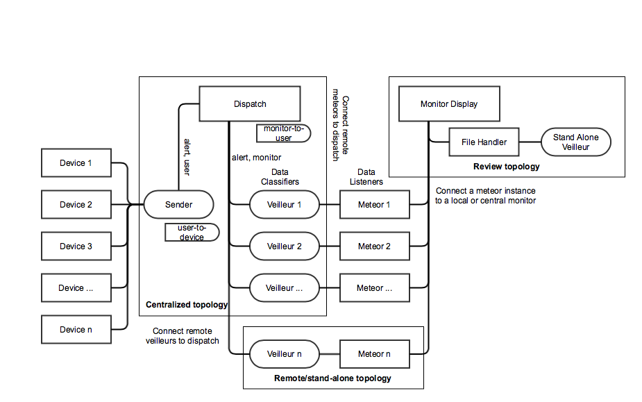

# PERSEUS
Push Electronic Relay for Smart Alarms for End User Situational Awareness

[Derek Merck](email:derek_merck@brown.edu)  
[Leo Kobayashi](email:lkobayashi@lifespan.org)  

<https://github.com/derekmerck/PERSEUS>


### Overview

To be discussed by Leo.

Original test site is at [Rhode Island Hospital](http://www.rhodeislandhospital.org) Emergency Department.


### Installation

`$ pip install https://github.com/derekmerck/PERSEUS`


### Dependencies

- Python 2.7
- [numpy](http://www.numpy.org) for calculations
- [matplotlib](http://matplotlib.org) for plotting
- [Pyro4](https://pythonhosted.org/Pyro4/) for python-to-python communication
- [PyYAML](http://pyyaml.org) for configuration info

The [Anaconda](http://continuum.io/downloads) scientific python distribution includes numpy, matplotlib and pyyaml, and
it works well for PERSEUS.  Pyro4 can be installed onto anaconda with `pip`.


### Usage

PERSEUS is run as a number of semi-independent instances that form a hub topology about a control server.  A shared
`config.yaml` file is the easiest way to describe the topology and provide other network settings.

````bash
usage: PERSEUS.py [-h] -p PID [-c CONFIG] [-s SHADOW] [--type TYPE]
                  [--controller CONTROLLER] [--location LOCATION]
                  [--devices DEVICES]

PERSEUS Core

optional arguments:
  -h, --help            show this help message and exit
  -p PID, --pid PID     P-node id REQ
  -c CONFIG, --config CONFIG
                        Configuration file (default: config.yaml)
  -s SHADOW, --shadow SHADOW
                        Shadow config file (default: shadow.yaml)
  --type TYPE           (config-free REQ) P-node type (server, monitor,
                        display)
  --controller CONTROLLER
                        (config-free OPT) Controller node name
                        (default=control0)
  --location LOCATION   (config-free OPT) P-node location
  --devices DEVICES     (config-free OPT) Dictionary of alert devices for
                        control nodes
````

The following would invoke a two node network.

```bash
main$ python -m Pyro4.naming
main$ ./PERSEUS.py -p control0  -c config.yaml
main$ ./PERSEUS.py -p display0  -c config.yaml
remote$ ./PERSEUS.py -p listener0 -c config.yaml
```

In this case, the main station is running two concurrent nodes, the controller and a graphical display.  The controller
acts as a central dispatch server, that accepts data streams, passes alerts to the SMS system, and pushes data streams 
out to graphical displays.  The remote station is running a listener that will forward information from bedside 
telemetry (a "METEOR" system) to the controller.

PERSEUS can also be invoked without a shared config file to stand-up a new listener or display node and connect to an 
existing controller:

```bash
new$ ./PERSEUS.py --pid display0  --type display --controller control0
new$ ./PERSEUS.py --pid listener0 --type listener --controller control0 \
     --alert_device phone001
```

A similar mechanism exists for setting up new control nodes, but this require more complex arguments.  See 
`PERSEUS.py --help` for details.

```bash
new$ python -m Pyro4.naming
new$ ./PERSEUS.py --pid control0  --type control --devices \
    '{"phone001": {"number": 4014445555, "carrier": "verizon"}}'
```

#### Configuration

`config.yaml` includes three document sections, settings, topology, and devices.  A basic format reference follows.

```yaml
# Settings

LOGGING_LEVEL: warning
ENABLE_SMS: False

---
# Topology

control0:  # The p-node id, or 'pid'
  type: control
  location: Main station

display0:
  type: display
  location: Main station

listener0:
  type: listener
  location: Remote patient monitor
  alert_device: phone001

--
# Alert Devices

phone001:  # The device id, or 'did'
  number: shadow
  carrier: verizon

```

Unless otherwise specified, the default controller for a listener or display node is the _first_ control-type node listed
(with subsequent controls eventually being used as backup).

Also note that any confidential information (SMS credentials, phone numbers) can be referenced with a value "shadow" and
included in a corresponding `shadow.yaml` file that follows the same format.  `shadow.yaml` is `.gitignored` by default.


#### Security

#### Network Security

PERSEUS is promiscuous in transmitting data input or display requests.  Access can be controlled at the network level by
using a VPN or private network, or by using Pyro4's HMAC authentication and a required shared key.  However, this is not
particularly secure as anyone with access to your shadow.yaml file or code will be able to extract the key in plain.  

#### SMS Alerts

Using gmail as the SMS relay requires either turning off app security in gmail, or assigning a unique relay password 
in the context of 2-step auth.


#### Code Organization Overview



_TODO: update code organization chart_


### Acknowledgements

- Initial development funded through an healthcare quality improvement award from the AHRQ
- SMS Messenger class cribbed in part from <https://github.com/CrakeNotSnowman/Python_Message>


### License

[MIT](http://opensource.org/licenses/mit-license.html) _TODO: probably, need to confirm with Leo_

